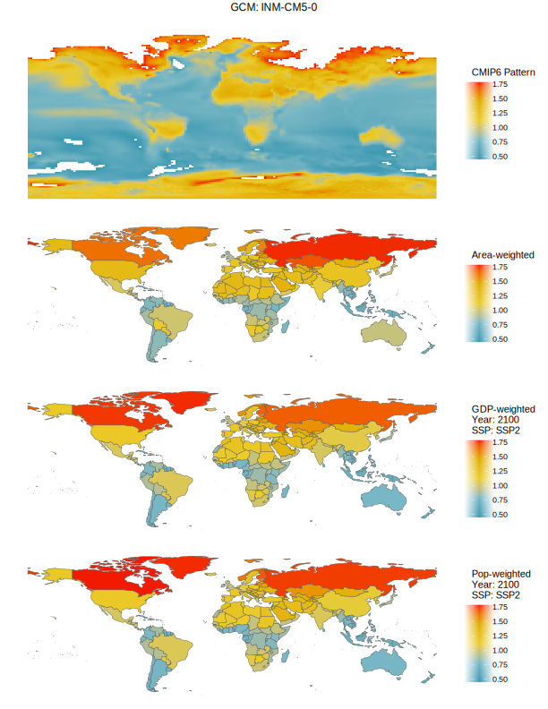
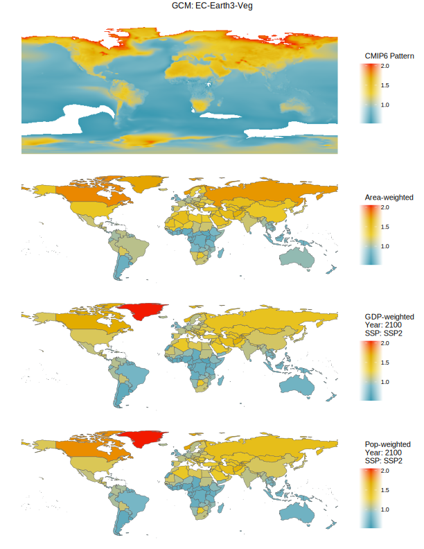

# Pattern Scaling of Global Climate Variables to Local Climate Variables for Use in Probabilistic Integrated Assessment Models

This repository provides an overview and replication of a pattern scaling approach used to recover local estimates of changes in surface temperature and changes in precipitation under various climate futures. The patterns are used in tandem with geopolitical boundaries and socioeconomic projections to recover area weighted, gdp weighted, and population weighted estimates of country and county-level (U.S.) average changes in climate variables that can be used as inputs to integrated assessment models. 

Reduced complexity climate models, such as the Finite Amplitude Impulse Response model (FaIR), often take inputs such as anthropogenic and natural emissions of greenhouse gases and estimate the resulting change in global mean surface temperature (GMST) and global mean surface precipitation (GMSP). While many climate-economy models, such as the Dynamic Integrated Climate-Economy ([DICE](https://williamnordhaus.com/dicerice-models)) or the Greenhouse Gas Impact Value Estimator ([GIVE](https://github.com/rffscghg/MimiGIVE.jl)), include damage functions that accept these global climate variables (e.g., GMST, GMSP), other damage functions require more spatially refined estimates of changes in climate (e.g., [Burke et al., 2015](https://www.nature.com/articles/nature15725); [Ricke et al., 2018](https://www.nature.com/articles/s41558-018-0282-y); [Carleton et al., 2022](https://academic.oup.com/qje/article/137/4/2037/6571943); [Bressler et al., 2022](https://www.nature.com/articles/s41598-021-99156-5)). These damage functions are typically at the country or county-level. As such, having country or county-level estimates of changes in surface temperature and surface precipitation are important to estimate economic damages and costs under future climate conditions.

One way to recover local estimates of temperature and precipitation under future climate scenarios is to simply use the range of estimates derived under Global Circulation Models (GCMs). However, these GCMs are computationally intensive and, as such, typically provide local estimates of climate variables for only a few commonly considered futures. For example, those provided under the Shared Socioeconomic Pathways (SSPs). To facilitate the estimation of many different local climate futures, a user can scale the spatially resolved projections coming from GCMs by estimating a statistical relationship between a global climate variable, such as mean surface temperature, and the GCMs local projections (Santer, 1990; Mitchell et al, 1999; Kravitz et al., 2016; Lynch et al., 2017). Using the resulting patterns, a user can recover local estimates of the patterned climate variable under a much larger range of climate futures in a fast and efficient way.

The products derived within this repository are: 

1. Changes in Local Mean Surface Temperature (LMST) from 1850-1900 averages.
2. Changes in Local Mean Surface Precipitation (LMSP) from 1850-1900 averages.

# Requirements

1. *R* is free and available for download [here](https://www.r-project.org/). The *RStudio* integrated development environment is useful for replication, it is free and available for download [here](https://www.rstudio.com/products/rstudio/).  

2. Optional: *Github* is free and available for download [here](https://github.com/git-guides/install-git). *Github* is used to house this repository and by installing and using it to clone the repository one will simplify the replication procedure. However, a user could also simply download a zipped file version of this repository, unzip in the desired location, and follow the replication procedures outlined below.

# Getting started

Begin by cloning or downloading a copy of this repository. This can be done by clicking on the green "code" button in this repository and following those instructions, or by navigating in the terminal via the command line to the desired location of the cloned repository and then typing: 

```
git clone https://github.com/usepa/pattern-scaled-climate-variables
```

Alternatively, you can make a `fork` of this repository and work from the fork in the same way. This allows for development on the `fork` while preserving its relationship with this repository.

# Global circulation models and pattern scaling

GCMs provide a range of different climate futures at spatially and temporally resolved resolutions. However, the are computationally expensive and prohibitive to use in many probabilistic settings (such as the methods underlying [Rennert et al. 2022](https://www.nature.com/articles/s41586-022-05224-9)). Instead, one can estimate spatial patterns by regressing the local value of the climate variable on the GMST. For an overview of the methods used within this repository, please see Lynch et al. (2017) (temperature) and Kravitz and Snyder (2022) (precipitation). 

Once the slope of the relationship between GMST and local climate variables is recovered, a user can project a range of GMST onto these relationships to recover LMST and LMSP at the spatial resolution of the GCMs. This method is well-established in the literature and is utilized, not advanced, within this repository. Instead, this repository provides a method for aggregating the spatially and temporally-resolved projections coming from GCMs and pattern scaling up to larger, commonly used, geopolitical jurisdictions.

# Local economic and population projections

Damage functions map changes in temperature to outcomes of interest such as those related to economic and market activities (e.g., gross domestic or regional product, GDP/GRP) or nonmarket health or ecosystem services (e.g., mortality or biodiversity). The approach used for mapping changes in temperature should couple temporally and spatially with the outcome of interest. For example, temperatures used to estimate damages to market outcomes such as GDP or GRP should reflect changes in temperature in market centers. Similarly, temperatures used to estimate damages to nonmarket outcomes such as mortality should reflect changes in temperature in population centers. Both approaches are estimated and compared in this document by weighting patterns with their relevant weight. Spatially explicit GDP and population, consistent with shared socioeconomic pathways (SSPs as used by the IPCC and World Bank) are recovered for the 184 countries contained within the SSPs from [Murakami and Yamagata (2016)](https://arxiv.org/abs/1610.09041). 

# Uncertainty 

Pattern scaling approaches result in a grid of predicted changes in local surface temperature resulting from a one degree change in GMST. Underlying these grids is conventional prediction error (or cell error) that captures the variation in local surface temperatures unexplained by the regression model. These errors are spatially correlated within the GCM and resulting pattern. Another source of uncertainty comes from the variation across GCMs used to derive the patterns. For this exercise, the variation across GCMs provides the main source of uncertainty, non-parametric and independent, in the resulting local changes in surface temperatures. 

# Local mean surface temperature

Socioeconomics: SSP1; GCM: BCC-CSM2-MR | Socioeconomics: SSP2; GCM: BCC-CSM2-MR
--- | ---
 | 

**Average Change in Local Mean Surface Temperature Across the 26 GCMs**
 

# Local mean surface precipitation

Average Change in Local Mean Surface Precipitation Across the 26 GCMs | Average Change in Local Mean Surface Precipitation Across the 26 GCMs over Land Areas (avg. is 1.35 times higher than GMST)
--- | ---
 | 

# License

The software code contained within this repository is made available under the [MIT license](http://opensource.org/licenses/mit-license.php). Any data and figures are made available under the [Creative Commons Attribution 4.0](https://creativecommons.org/licenses/by/4.0/) license.

# Citations

## Citing this repository

US EPA. Pattern Scaling of Global Climate Variables. 2023. https://github.com/usepa/pattern-scaled-climate-variables

## Climate data

Eyring, V., Bony, S., Meehl, G. A., Senior, C. A., Stevens, B., Stouffer, R. J., and Taylor, K. E.: Overview of the Coupled Model Intercomparison Project Phase 6 (CMIP6) experimental design and organization, Geosci. Model Dev., 9, 1937–1958, https://doi.org/10.5194/gmd-9-1937-2016, 2016.

Earth System Grid Federation: https://esgf-node.llnl.gov/projects/esgf-llnl/

## Socioeconomics

Murakami, D. and Yamagata, Y. (2016) Estimation of gridded population and GDP scenarios with spatially explicit statistical downscaling, ArXiv, 1610.09041, URL: https://arxiv.org/abs/1610.09041.

## Patterns

Kravitz, B., Lynch, C., Hartin, C., and Bond-Lamberty, B.: Exploring precipitation pattern scaling methodologies and robustness among CMIP5 models, Geosci. Model Dev. Discuss., doi:10.5194/gmd-2016-258, in review, 2016.

Kravitz, Ben, & Snyder, Abigail. (2022). Pangeo-Enabled ESM Pattern Scaling (PEEPS): A customizable dataset of emulated Earth System Model output [Data set]. Zenodo. https://doi.org/10.5281/zenodo.7139978

Lynch, C., Hartin, C., Bond-Lamberty, B., and Kravitz, B.: An open-access CMIP5 pattern library for temperature and precipitation: Description and methodology, Earth Syst. Sci. Data Discuss., doi:10.5194/essd-2016-68, in review, 2017.
